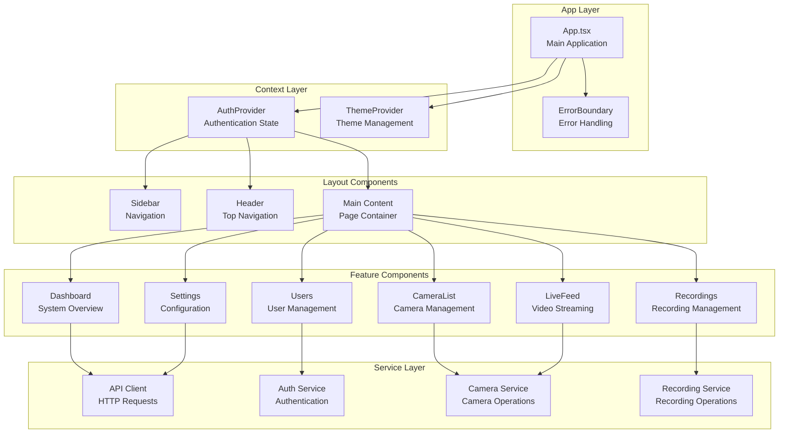
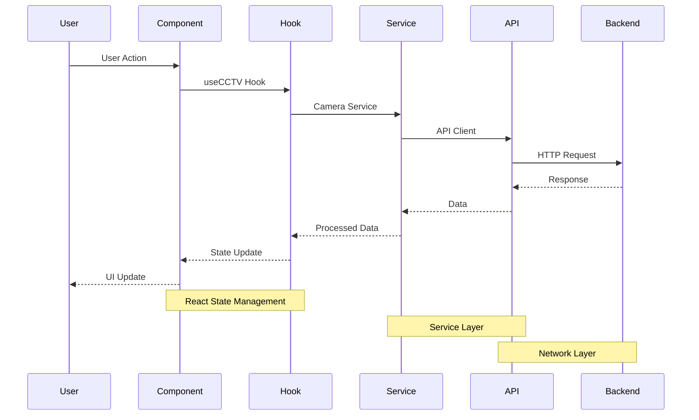
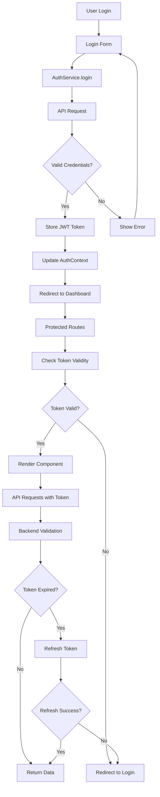
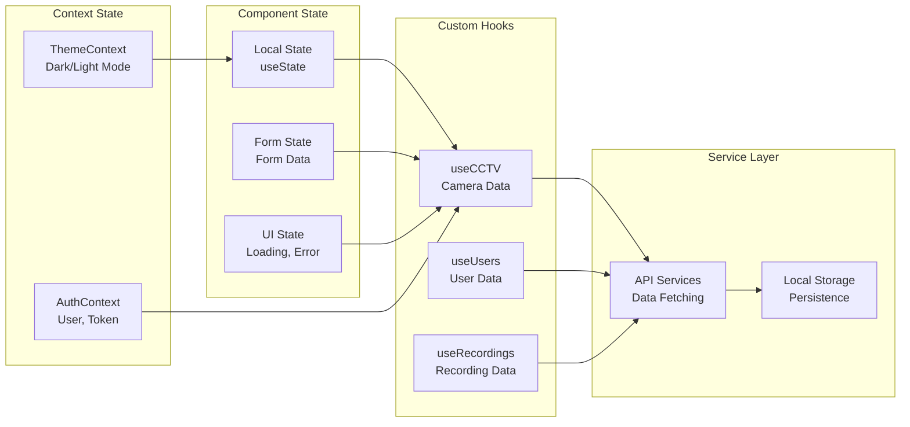
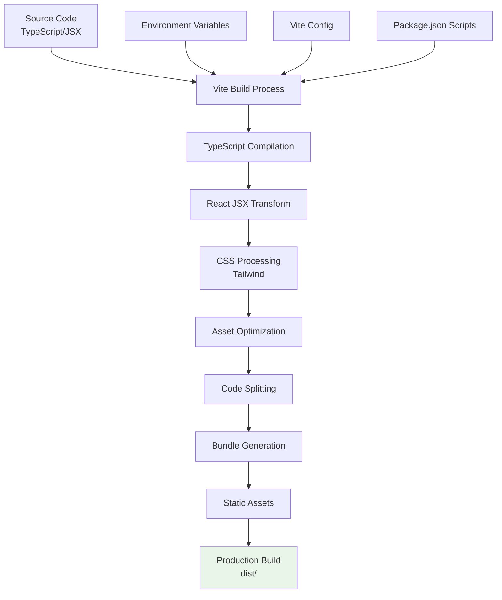
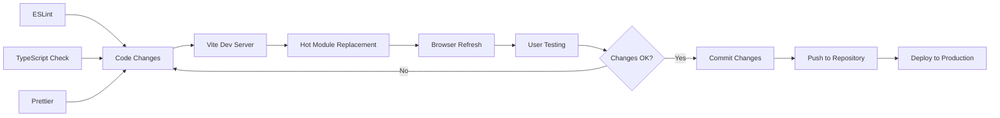

# Security Camera Management System

A modern, responsive web application for managing security cameras, live feeds, recordings, and access control. Built with React, TypeScript, and Tailwind CSS.

## 🚀 Features

### Core Functionality
- **Dashboard**: Overview of system status, camera counts, and recent alerts
- **Camera Management**: Add, edit, and monitor security cameras
- **Live Feed**: Real-time camera streams with status monitoring
- **Recording Management**: View and manage recorded footage
- **User Management**: Role-based access control with permissions
- **Access Control**: API endpoints and access management
- **Scheduling**: Automated recording and maintenance schedules
- **Settings**: System configuration and preferences

### Technical Features
- **Authentication**: Secure login system with role-based access
- **Responsive Design**: Mobile-first approach with Tailwind CSS
- **Dark/Light Theme**: Toggle between themes
- **TypeScript**: Full type safety and better development experience
- **Modern UI**: Clean, intuitive interface with modern design patterns

## 🛠️ Tech Stack

- **Frontend**: React 18 + TypeScript
- **Build Tool**: Vite
- **Styling**: Tailwind CSS
- **Icons**: Lucide React
- **State Management**: React Context API
- **Code Quality**: ESLint + TypeScript ESLint

## 🏗️ Architecture Diagrams

### Component Architecture


### Data Flow Architecture


### Authentication Flow


### State Management Flow


### Build Process


### Development Workflow


## 📋 Prerequisites

- Node.js (version 16 or higher)
- npm or yarn package manager

## 🚀 Getting Started

### 1. Clone the Repository
```bash
git clone <repository-url>
cd project
```

### 2. Install Dependencies
```bash
npm install
```

### 3. Start Development Server
```bash
npm run dev
```

The application will be available at `http://localhost:5173`

### 4. Build for Production
```bash
npm run build
```

### 5. Preview Production Build
```bash
npm run preview
```

## 📁 Project Structure

```
src/
├── components/          # React components
│   ├── AccessControl/   # Access control management
│   ├── Auth/           # Authentication components
│   ├── Cameras/        # Camera management
│   ├── Dashboard/      # Dashboard views
│   ├── Layout/         # Header and sidebar
│   ├── LiveFeed/       # Live camera feeds
│   ├── Profile/        # User profile management
│   ├── Recordings/     # Recording management
│   ├── Schedule/       # Scheduling system
│   ├── Settings/       # Application settings
│   └── Users/          # User management
├── contexts/           # React contexts
│   ├── AuthContext.tsx # Authentication state
│   └── ThemeContext.tsx # Theme management
├── hooks/              # Custom React hooks
├── types/              # TypeScript type definitions
└── main.tsx           # Application entry point
```

## 🔐 Authentication & Roles

The system supports three user roles:

- **Admin**: Full system access and user management
- **Operator**: Camera control and recording management
- **Viewer**: Read-only access to camera feeds and recordings

## 📱 Available Scripts

- `npm run dev` - Start development server
- `npm run build` - Build for production
- `npm run preview` - Preview production build
- `npm run lint` - Run ESLint for code quality

## 🎨 Customization

### Themes
The application supports both light and dark themes. Users can toggle between themes using the theme switcher in the header.

### Styling
The application uses Tailwind CSS for styling. Custom styles can be added in `src/index.css` or by extending the Tailwind configuration in `tailwind.config.js`.

## 🔧 Configuration

### Tailwind CSS
Tailwind configuration can be found in `tailwind.config.js`. You can customize colors, spacing, and other design tokens here.

### PostCSS
PostCSS configuration is in `postcss.config.js` for processing CSS with autoprefixer.

### TypeScript
TypeScript configuration files:
- `tsconfig.json` - Main TypeScript configuration
- `tsconfig.app.json` - App-specific configuration
- `tsconfig.node.json` - Node.js configuration

## 📊 Data Models

The application includes comprehensive TypeScript interfaces for:

- **Camera**: Camera configuration and status
- **User**: User accounts and permissions
- **Recording**: Video recording metadata
- **Schedule**: Automated task scheduling
- **AccessEndpoint**: API access management

## 🚀 Deployment

### Build for Production
```bash
npm run build
```

The built files will be in the `dist/` directory, ready for deployment to any static hosting service.

### Recommended Hosting
- **Vercel**: Excellent for React applications
- **Netlify**: Great for static sites
- **AWS S3 + CloudFront**: Enterprise-grade hosting
- **GitHub Pages**: Free hosting for public repositories

## 🤝 Contributing

1. Fork the repository
2. Create a feature branch (`git checkout -b feature/amazing-feature`)
3. Commit your changes (`git commit -m 'Add some amazing feature'`)
4. Push to the branch (`git push origin feature/amazing-feature`)
5. Open a Pull Request

## 📝 License

This project is licensed under the MIT License - see the LICENSE file for details.

## 📅 Video Scheduling Guide

### Creating Recording Schedules

The scheduling system allows you to automate video recording based on different patterns:

#### 1. Schedule Types

**Continuous Recording:**
- Records 24/7 without interruption
- Best for high-security areas
- Automatically manages storage space

**One-time Schedule:**
- Records for a specific date range
- Perfect for events or temporary monitoring
- Automatically expires after end date

**Daily Schedule:**
- Repeats every day at specified times
- Ideal for business hours monitoring
- Customizable start and end times

**Weekly Schedule:**
- Repeats on selected days of the week
- Great for different schedules per day
- Supports multiple day selection

#### 2. Creating a Schedule

```typescript
// Navigate to Schedule page
// Click "New Schedule" button
// Fill in the form:

{
  camera: "camera-id",           // Select target camera
  name: "Daily Recording",       // Descriptive name
  schedule_type: "daily",        // Type of schedule
  start_date: "2024-01-01",     // Start date
  end_date: "2024-12-31",       // End date
  start_time: "09:00",          // Start time
  end_time: "17:00",            // End time
  days_of_week: ["monday", "tuesday", "wednesday", "thursday", "friday"],
  is_active: true               // Enable immediately
}
```

#### 3. Schedule Management

**Viewing Schedules:**
- All schedules displayed in table format
- Filter by type, camera, or status
- Real-time status indicators

**Editing Schedules:**
- Click edit button on any schedule
- Modify settings and save changes
- Changes take effect immediately

**Activating/Deactivating:**
- Toggle schedule status with power button
- Inactive schedules won't trigger recording
- Expired schedules show special status

**Deleting Schedules:**
- Remove schedules permanently
- Confirmation dialog prevents accidents
- Cannot be undone

#### 4. Schedule Status Indicators

```typescript
// Status meanings:
"Active" - Schedule is running and recording
"Inactive" - Schedule is disabled
"Expired" - One-time schedule past end date
```

#### 5. Best Practices

**Storage Management:**
- Set appropriate recording quality
- Use daily schedules for business hours
- Monitor storage usage regularly

**Camera Selection:**
- Ensure camera is online before scheduling
- Test camera connection first
- Consider camera load balancing

**Time Configuration:**
- Use 24-hour format for clarity
- Account for timezone differences
- Set realistic recording durations

## 🔧 Camera Error Handling & Troubleshooting

### Common Camera Issues

#### 1. Camera Connection Problems

**Symptoms:**
- Camera shows "Offline" status
- Live feed displays error message
- "Failed to load stream" error

**Solutions:**

**Automatic Recovery:**
```typescript
// The system automatically attempts recovery:
1. Detects offline camera
2. Attempts to set camera online (max 2 attempts)
3. Refreshes stream connection
4. Shows recovery status to user
```

**Manual Recovery:**
```typescript
// Manual recovery steps:
1. Go to Live Feed page
2. Select offline camera
3. Click "Recover Camera" button
4. Wait for recovery process
5. Verify stream is working
```

**Camera List Recovery:**
```typescript
// From Camera List page:
1. Find offline camera in list
2. Click "Set Online" button (orange icon)
3. Wait for confirmation message
4. Check status updates to "Online"
```

#### 2. Stream Loading Issues

**Symptoms:**
- Black screen in live feed
- Loading spinner never stops
- "Stream Error" message

**Troubleshooting Steps:**

**Step 1: Check Camera Status**
```typescript
// Verify camera is online:
1. Go to Camera List page
2. Check camera status indicator
3. Look for "Online" status
4. If offline, use recovery button
```

**Step 2: Test Stream Connection**
```typescript
// Test stream info:
1. Click "Stream Info" button (settings icon)
2. Check supported qualities
3. Verify streaming status
4. Look for error messages
```

**Step 3: Refresh Stream**
```typescript
// Refresh stream:
1. Click "Refresh" button (blue icon)
2. Wait for stream to reload
3. Check for error messages
4. Try different quality if available
```

**Step 4: Check Network Connection**
```typescript
// Network troubleshooting:
1. Verify camera IP is reachable
2. Check RTSP URL format
3. Test with ping command
4. Verify firewall settings
```

#### 3. Quality and Performance Issues

**Symptoms:**
- Poor video quality
- Choppy or frozen video
- High bandwidth usage

**Solutions:**

**Bandwidth Saver Mode:**
```typescript
// Enable bandwidth saver:
1. Go to Live Feed page
2. Click "Bandwidth Saver" button (eye icon)
3. Stream switches to lower quality
4. Reduces data usage
```

**Quality Adjustment:**
```typescript
// Change stream quality:
1. Click "Quality" button (settings icon)
2. Cycle through available qualities
3. Select appropriate quality
4. Stream refreshes automatically
```

**Auto-Pause Settings:**
```typescript
// Configure auto-pause:
1. Toggle "Auto-pause" button (wifi icon)
2. Stream pauses when tab is hidden
3. Resumes when tab becomes active
4. Saves bandwidth and resources
```

#### 4. Camera Configuration Issues

**Symptoms:**
- Camera not appearing in list
- Incorrect camera details
- Recording not working

**Solutions:**

**Camera Registration:**
```typescript
// Add new camera:
1. Go to Camera List page
2. Click "Add Camera" button
3. Fill in camera details:
   - Name and location
   - IP address and port
   - RTSP URL and credentials
   - Recording settings
4. Test connection before saving
```

**Camera Import (CSV):**
```typescript
// Bulk import cameras:
1. Prepare CSV file with columns:
   - Name, Location, IP Address
   - Port, Username, Status
   - Recording Enabled
2. Click "Import CSV" button
3. Select prepared file
4. Verify import results
```

**Camera Export:**
```typescript
// Export camera list:
1. Click "Export CSV" button
2. Download camera configuration
3. Use for backup or migration
4. Contains all camera settings
```

#### 5. Error Messages and Solutions

**"Camera is offline"**
```typescript
// Solution:
1. Check camera power and network
2. Verify IP address and port
3. Test RTSP URL manually
4. Use recovery button
```

**"Failed to load stream"**
```typescript
// Solution:
1. Refresh stream connection
2. Check camera status
3. Verify network connectivity
4. Try different quality setting
```

**"Stream not available"**
```typescript
// Solution:
1. Ensure camera is online
2. Check RTSP configuration
3. Verify credentials
4. Test with external player
```

**"Recovery failed"**
```typescript
// Solution:
1. Check camera hardware
2. Verify network settings
3. Restart camera if possible
4. Contact administrator
```

### Debug Information

**Enable Debug Mode:**
```bash
# Set environment variable
VITE_ENABLE_DEBUG=true npm run dev

# Check browser console for detailed logs
# Look for camera status updates
# Monitor stream connection attempts
```

**Stream Info Panel:**
```typescript
// Available in Live Feed page:
- Camera status (online/offline)
- Streaming status (active/inactive)
- Supported qualities
- Session duration
- Error messages
```

**Browser Developer Tools:**
```typescript
// Check Network tab for:
- RTSP connection attempts
- Stream URL requests
- Error responses
- Response times
```

### Performance Optimization

**Stream Management:**
```typescript
// Optimize performance:
1. Use appropriate quality setting
2. Enable bandwidth saver mode
3. Pause streams when not needed
4. Close unused browser tabs
```

**Memory Management:**
```typescript
// Prevent memory leaks:
1. Streams auto-pause when tab hidden
2. Refresh streams periodically
3. Clear browser cache if needed
4. Restart browser for long sessions
```


## 🆘 Support

If you encounter any issues or have questions:

1. Check the existing issues in the repository
2. Create a new issue with detailed information
3. Include steps to reproduce the problem
4. Provide your environment details (OS, Node.js version, etc.)


---

